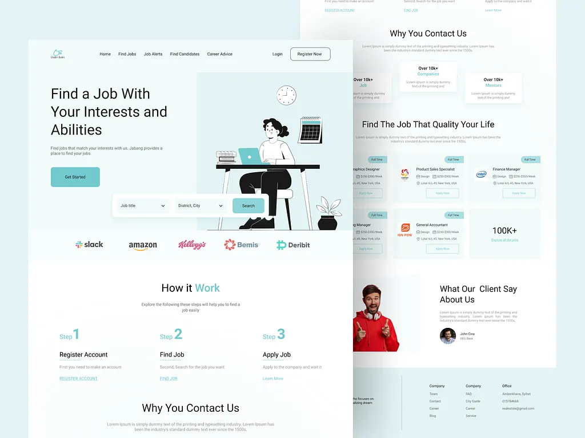

<div align="center">

  <h1>⚡ 404 Job Not Found</h1>
  <p><b>AI-Powered Career Operating System & Intelligent Job Discovery Engine</b></p>

  <p>
    <a href="https://nextjs.org"></a>
    <a href="https://fastify.io"></a>
    <a href="https://www.prisma.io"></a>
    <a href="https://tailwindcss.com"></a>
    <a href="https://www.typescriptlang.org"></a>
    <a href="https://pnpm.io"></a>
    <a href="https://www.docker.com"></a>
  </p>

  <p>
    <b>404 Job Not Found</b> bridges the gap between candidate qualifications and ideal career opportunities through AI recommendations, real-time multi-provider job aggregation, and automated career tracking.
  </p>

</div>

---

## 🌟 Key Features

- **🤖 Intelligent Job Matching:** Machine-learning recommendations tailored to candidate skills, target roles, and career trajectory.
- **🌐 Multi-Provider Job Aggregation:** Integrated external job ingestion from **Adzuna**, **Arbeitnow**, **Greenhouse**, **Jobicy**, **Jooble**, **Lever**, **Remotive**, and **SerpAPI**.
- **⚡ Asynchronous Queue Architecture:** Powered by **BullMQ** and **Redis** for scheduled background scraping, data cleaning, and automated indexing.
- **📊 Candidate Dashboard & Tracking:** Real-time application pipelines, status tracking, saved jobs, and skill gap visualizers.
- **🔒 Enterprise Security:** Modern JWT authentication, role-based access control (RBAC), and Fastify security middleware.
- **🎨 Modern Responsive UI:** Next.js App Router UI with Tailwind CSS v4, Lucide React icons, dark/light aesthetics, and smooth animations.

---

## 📸 Interface Preview

<div align="center">
  <table border="0">
    <tr>
      <td align="center" width="60%">
        <b>Web Dashboard & Job Discovery Platform</b><br/><br/>
        
      </td>
      <td align="center" width="40%">
        <b>Mobile Experience</b><br/><br/>
        
      </td>
    </tr>
  </table>
</div>

---

## 🏗️ Project Architecture

**404 Job Not Found** is structured as an enterprise-grade **pnpm monorepo**:

```
404-job-not-found/
├── 📁 .github/workflows/   # CI/CD pipelines (Linting, Typechecking, Build verification)
├── 📁 backend/             # Fastify v5 API Server, Prisma ORM, BullMQ background workers
│   ├── 📁 src/modules/auth/ # Authentication & user profile services
│   ├── 📁 src/modules/jobs/ # Job scraping, matching engines & external providers
│   ├── 📁 src/workers/      # Background queue workers (Adzuna, etc.)
│   └── 📁 prisma/          # Database schema definitions & seed scripts
├── 📁 frontend/            # Next.js 16 (App Router), React 19, Tailwind CSS v4 UI
│   └── 📁 src/app/          # Next.js App Router pages & dashboards
├── 📁 docker/              # Infrastructure orchestration (PostgreSQL, Redis, MinIO)
├── 📁 docs/                # Architecture diagrams, blueprints, and UI assets
├── 📁 packages/            # Shared TypeScript & ESLint configurations
├── 📄 design.md            # Design system, color palettes & guidelines
├── 📄 memory.md            # Active project state & tracking log
└── 📄 rules.md             # Coding standards & developer instructions
```

---

## 🛠️ Technology Stack

| Layer | Technology | Description |
| :--- | :--- | :--- |
| **Workspace Manager** | `pnpm` Monorepo | Monorepo package linking and script execution |
| **Frontend Framework** | Next.js 16 & React 19 | App Router, Turbopack, Server/Client components |
| **Styling & Icons** | Tailwind CSS v4 & Lucide | Modern styling tokens, responsive grids & UI icons |
| **Backend API** | Fastify v5 & tsoa | High-performance HTTP server with auto-generated OpenAPI/Swagger |
| **Database & ORM** | PostgreSQL & Prisma ORM | Relational data persistence with strict type safety |
| **Queue & Cache** | BullMQ & Redis | Background job processing, job caching, and rate limiting |
| **Object Storage** | MinIO (S3-compatible) | Media & resume file uploads |
| **Containerization** | Docker & Docker Compose | Containerized local development environment |

---

## 🚀 Getting Started

### 1. Prerequisites
Ensure you have the following installed on your machine:
- **Node.js**: `v20.0.0` or higher
- **pnpm**: `v9.0.0` or higher
- **Docker Desktop** / Docker Engine & Docker Compose

### 2. Clone the Repository
```bash
git clone https://github.com/Soumen-Developer/404-job-not-found.git
cd 404-job-not-found
```

### 3. Spin Up Infrastructure
Start local PostgreSQL, Redis, and MinIO storage services:
```bash
docker compose -f docker/compose/docker-compose.yml up -d
```

### 4. Install Dependencies
Install all workspace dependencies:
```bash
pnpm install
```

### 5. Initialize Database & Seed Data
Execute database migrations and seed sample candidate & job data:
```bash
# Run database migrations
pnpm --filter @cy-jobs/backend exec prisma migrate dev

# Generate Prisma Client
pnpm --filter @cy-jobs/backend exec prisma generate

# Seed initial database records
pnpm --filter @cy-jobs/backend exec prisma db seed
```

### 6. Start Development Servers
Run frontend and backend services in parallel:
```bash
pnpm run dev
```

- 🌐 **Frontend Application:** [http://localhost:3000](http://localhost:3000)
- ⚙️ **Backend API Engine:** [http://localhost:3001](http://localhost:3001)
- 📜 **Interactive Swagger Docs:** [http://localhost:3001/docs](http://localhost:3001/docs)

---

## 🧹 Code Quality & Scripts

Run checks across the monorepo:

| Command | Action |
| :--- | :--- |
| `pnpm run dev` | Start development servers for frontend & backend |
| `pnpm run lint` | Run ESLint across all workspaces |
| `pnpm run format` | Format codebase using Prettier |
| `pnpm run build` | Build production bundles for frontend & backend |

---

<div align="center">
  <sub>Built with ❤️ by Soumen-Developer. Designed for modern candidate empowerment.</sub>
</div>
