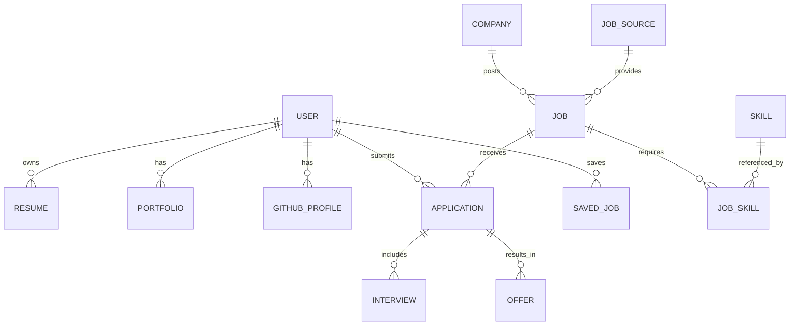

# Enterprise AI Career Platform Architecture

This document outlines the architectural blueprint, database schema, and technical pipelines to build an AI-powered Career Intelligence Platform.

## User Review Required
> [!IMPORTANT]  
> Please review the `schema.prisma` and architectural decisions. Let me know if you would like to adjust the boundaries of the microservices or adapt the authentication strategy (e.g., adding Supabase or Clerk) before we proceed to execution.

## Open Questions
- Do you want to use a managed Auth provider (like Clerk/Auth0/Supabase) or stick to a custom JWT implementation in NestJS as described in the original blueprint?
- For Vector Search, are we strictly using `pgvector`, or would you like to introduce Qdrant/Pinecone for larger-scale vector operations?
- Should we organize the repository as a monorepo (e.g., Turborepo) containing both frontend and backend?

## Proposed Architecture

### 1. Database Architecture & Prisma Schema
The database is normalized to support complex queries while incorporating `pgvector` for scalable AI matching (Resume embeddings and Job embeddings).

```prisma
generator client {
  provider = "prisma-client-js"
}

datasource db {
  provider = "postgresql"
  url      = env("DATABASE_URL")
  extensions = [pgvector(map: "vector")]
}

// ==========================================
// 1. AUTH & USER MODULE
// ==========================================

model User {
  id                String    @id @default(uuid())
  email             String    @unique
  passwordHash      String?
  authProvider      String?   // 'local', 'google', 'github', 'linkedin'
  role              Role      @default(CANDIDATE) // CANDIDATE, EMPLOYER, ADMIN
  
  // Profile info
  firstName         String?
  lastName          String?
  headline          String?
  preferredLocation String?
  remotePreference  String?   // 'remote', 'hybrid', 'onsite'
  expectedSalaryMin Int?
  expectedSalaryMax Int?
  currency          String    @default("USD")
  
  createdAt         DateTime  @default(now())
  updatedAt         DateTime  @updatedAt
  
  // Relations
  resumes           Resume[]
  portfolio         Portfolio?
  githubProfile     GitHubProfile?
  userSkills        UserSkill[]
  educations        Education[]
  experiences       Experience[]
  certifications    Certification[]
  
  applications      Application[]
  savedJobs         SavedJob[]
  jobAlerts         JobAlert[]
  savedSearches     SavedSearch[]
  
  companyId         String?
  company           Company?  @relation(fields: [companyId], references: [id])
}

enum Role {
  CANDIDATE
  EMPLOYER
  RECRUITER
  ADMIN
}

// ==========================================
// 2. CANDIDATE PROFILE (RESUME, PORTFOLIO, SKILLS)
// ==========================================

model Resume {
  id              String          @id @default(uuid())
  userId          String
  user            User            @relation(fields: [userId], references: [id])
  isPrimary       Boolean         @default(false)
  title           String?
  
  versions        ResumeVersion[]
  
  createdAt       DateTime        @default(now())
  updatedAt       DateTime        @updatedAt
}

model ResumeVersion {
  id              String    @id @default(uuid())
  resumeId        String
  resume          Resume    @relation(fields: [resumeId], references: [id])
  fileUrl         String
  parsedText      String    @db.Text
  
  atsScore        Float?
  resumeScore     Float?
  
  // pgvector extension for similarity search
  embedding       Unsupported("vector(1536)")?
  
  createdAt       DateTime  @default(now())
}

model Portfolio {
  id              String    @id @default(uuid())
  userId          String    @unique
  user            User      @relation(fields: [userId], references: [id])
  websiteUrl      String?
  behanceUrl      String?
  dribbbleUrl     String?
  score           Float?
}

model GitHubProfile {
  id              String    @id @default(uuid())
  userId          String    @unique
  user            User      @relation(fields: [userId], references: [id])
  username        String
  url             String
  developerScore  Float?
  
  repositories    GitHubRepository[]
}

model GitHubRepository {
  id              String        @id @default(uuid())
  profileId       String
  profile         GitHubProfile @relation(fields: [profileId], references: [id])
  name            String
  url             String
  language        String?
  description     String?
  stars           Int           @default(0)
}

model Skill {
  id              String      @id @default(uuid())
  name            String      @unique
  category        String?
  
  userSkills      UserSkill[]
  jobSkills       JobSkill[]
}

model UserSkill {
  id              String    @id @default(uuid())
  userId          String
  user            User      @relation(fields: [userId], references: [id])
  skillId         String
  skill           Skill     @relation(fields: [skillId], references: [id])
  proficiency     String?   // 'BEGINNER', 'INTERMEDIATE', 'EXPERT'
  yearsExperience Float?
  
  @@unique([userId, skillId])
}

model Education {
  id              String    @id @default(uuid())
  userId          String
  user            User      @relation(fields: [userId], references: [id])
  institution     String
  degree          String?
  fieldOfStudy    String?
  startDate       DateTime?
  endDate         DateTime?
}

model Experience {
  id              String    @id @default(uuid())
  userId          String
  user            User      @relation(fields: [userId], references: [id])
  companyName     String
  title           String
  description     String?   @db.Text
  startDate       DateTime
  endDate         DateTime?
  isCurrent       Boolean   @default(false)
}

model Certification {
  id              String    @id @default(uuid())
  userId          String
  user            User      @relation(fields: [userId], references: [id])
  name            String
  issuer          String
  issueDate       DateTime?
  url             String?
}

// ==========================================
// 3. JOB & EMPLOYER MODULE
// ==========================================

model Company {
  id              String    @id @default(uuid())
  name            String
  logoUrl         String?
  website         String?
  industry        String?
  size            String?
  description     String?   @db.Text
  rating          Float?
  
  jobs            Job[]
  employees       User[]    // Recruiters/Employers
}

model JobSource {
  id              String    @id @default(uuid())
  name            String    @unique
  type            String    // 'ATS', 'AGGREGATOR', 'INTERNAL'
  isActive        Boolean   @default(true)
  
  jobs            Job[]
}

model Job {
  id              String    @id @default(uuid())
  title           String
  companyId       String?
  company         Company?  @relation(fields: [companyId], references: [id])
  companyName     String?   // Fallback if company not registered
  
  sourceId        String
  source          JobSource @relation(fields: [sourceId], references: [id])
  externalId      String?   // For deduplication
  
  description     String    @db.Text
  employmentType  String?   // FULL_TIME, PART_TIME, CONTRACT
  workMode        String?   // REMOTE, HYBRID, ONSITE
  
  salaryMin       Int?
  salaryMax       Int?
  currency        String    @default("USD")
  
  experienceMin   Int?
  experienceMax   Int?
  
  applyUrl        String?
  isEasyApply     Boolean   @default(false)
  
  status          JobStatus @default(OPEN)
  
  embedding       Unsupported("vector(1536)")?
  
  postedAt        DateTime?
  createdAt       DateTime  @default(now())
  updatedAt       DateTime  @updatedAt
  
  jobSkills       JobSkill[]
  locations       JobLocation[]
  applications    Application[]
  savedBy         SavedJob[]
  
  @@unique([sourceId, externalId])
}

enum JobStatus {
  OPEN
  CLOSED
  DRAFT
}

model JobSkill {
  id              String    @id @default(uuid())
  jobId           String
  job             Job       @relation(fields: [jobId], references: [id])
  skillId         String
  skill           Skill     @relation(fields: [skillId], references: [id])
  isOptional      Boolean   @default(false)
  
  @@unique([jobId, skillId])
}

model JobLocation {
  id              String    @id @default(uuid())
  jobId           String
  job             Job       @relation(fields: [jobId], references: [id])
  country         String
  state           String?
  city            String?
}

// ==========================================
// 4. APPLICATION & TRACKING
// ==========================================

model Application {
  id              String    @id @default(uuid())
  userId          String
  user            User      @relation(fields: [userId], references: [id])
  jobId           String
  job             Job       @relation(fields: [jobId], references: [id])
  
  status          ApplicationStatus @default(APPLIED)
  matchScore      Float?
  
  appliedAt       DateTime  @default(now())
  updatedAt       DateTime  @updatedAt
  
  interviews      Interview[]
  offers          Offer[]
}

enum ApplicationStatus {
  APPLIED
  REVIEWING
  SCREENING
  INTERVIEWING
  OFFERED
  HIRED
  REJECTED
  WITHDRAWN
}

model Interview {
  id              String      @id @default(uuid())
  applicationId   String
  application     Application @relation(fields: [applicationId], references: [id])
  scheduledAt     DateTime
  type            String      // 'TECHNICAL', 'HR', 'BEHAVIORAL'
  feedback        String?     @db.Text
}

model Offer {
  id              String      @id @default(uuid())
  applicationId   String
  application     Application @relation(fields: [applicationId], references: [id])
  baseSalary      Int
  currency        String
  equity          String?
  status          String      // 'PENDING', 'ACCEPTED', 'DECLINED'
}

// ==========================================
// 5. SEARCH & ALERTS
// ==========================================

model SavedJob {
  id              String    @id @default(uuid())
  userId          String
  user            User      @relation(fields: [userId], references: [id])
  jobId           String
  job             Job       @relation(fields: [jobId], references: [id])
  savedAt         DateTime  @default(now())
  
  @@unique([userId, jobId])
}

model SavedSearch {
  id              String    @id @default(uuid())
  userId          String
  user            User      @relation(fields: [userId], references: [id])
  query           String
  filters         Json?
  createdAt       DateTime  @default(now())
  lastExecutedAt  DateTime?
}

model JobAlert {
  id              String    @id @default(uuid())
  userId          String
  user            User      @relation(fields: [userId], references: [id])
  query           String
  filters         Json?
  frequency       String    // 'DAILY', 'WEEKLY', 'INSTANT'
  channels        String[]  // ['EMAIL', 'PUSH']
  createdAt       DateTime  @default(now())
}
```

### 2. ER Diagram


### 3. API Specification Overview
- `POST /api/v1/jobs/search` - Hybrid search (Keyword + Vector Semantic Search)
- `POST /api/v1/resume/analyze` - Parses resume and extracts skills using LLM
- `POST /api/v1/resume/match` - Vector-based comparison of Resume against Jobs
- `GET /api/v1/profile/insights` - Career progression and skill gap analysis
- `GET /api/v1/company/:id/intelligence` - Salary ranges, funding, tech stack
- `POST /api/v1/github/analyze` - Ingests repositories and scores dev profile

### 4. Search & AI Pipeline Architecture
- **Primary Database**: PostgreSQL (Source of Truth)
- **Vector Store**: PostgreSQL + `pgvector` for semantic matching (Resume-to-Job matching).
- **Full-Text Search Engine**: Elasticsearch / OpenSearch for faceted search, typo tolerance, and fast text querying.
- **Cache**: Redis for auto-suggestions, trending searches, and API rate limiting.
- **Message Queue**: BullMQ (backed by Redis) for async background tasks like job aggregation, GitHub repository parsing, and LLM embedding generation.

### 5. Folder Structures

**Backend (NestJS)**
```
backend/
├── prisma/               # schema.prisma, migrations
├── src/
│   ├── modules/
│   │   ├── auth/         # JWT, guards, strategies
│   │   ├── users/        # Profile, portfolio, preferences
│   │   ├── resume/       # PDF parse, embeddings generation
│   │   ├── jobs/         # Elasticsearch sync, CRUD
│   │   ├── aggregator/   # Scraping & APIs (Adzuna, Greenhouse)
│   │   ├── search/       # Hybrid search logic (ES + pgvector)
│   │   ├── ai/           # LLM services (prompts, matching)
│   │   ├── github/       # Repository analysis
│   │   └── alerts/       # Cron jobs for emails/digests
│   ├── common/           # DTOs, interceptors, filters
│   └── main.ts
```

**Frontend (Next.js)**
```
frontend/
├── app/
│   ├── (auth)/           # Login, Register
│   ├── jobs/             # Search, Job Details
│   ├── dashboard/        # Application tracking, insights
│   ├── resume/           # AI Resume Builder & Analyzer
│   └── profile/          # Dev portfolio, Github connect
├── components/           # UI elements, widgets
├── lib/                  # API clients, utilities
└── store/                # State management (Zustand)
```
