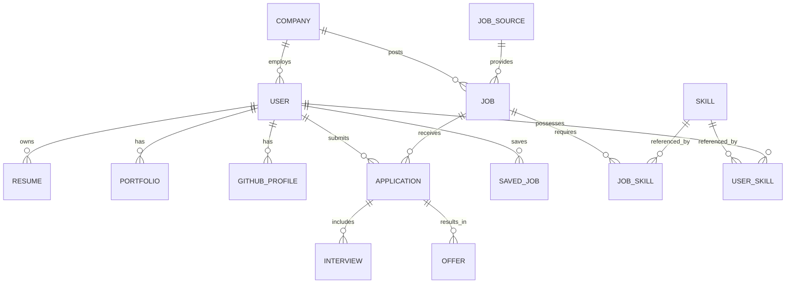

# AI Career Platform - Comprehensive Technical Architecture

This document contains the complete technical blueprint, architectures, pipelines, and schema to build the enterprise-grade AI Career Intelligence Platform.

---

## 1. Database Architecture & Prisma Schema

### Database Architecture Decisions
- **PostgreSQL as Primary Store**: Ensures relational integrity for user data, jobs, and applications.
- **pgvector**: Used natively for vector similarity (e.g., `embedding Unsupported("vector(1536)")`) for resume-to-job matching and semantic search.
- **Soft Deletes & Auditing**: Tables include `createdAt`, `updatedAt`, and status fields (e.g., `JobStatus`, `ApplicationStatus`). 
- **Normalization vs Denormalization**: Highly normalized for `Skills`, `Users`, and `Jobs`. Denormalized for read-heavy operations like `search_vector` caching.

```prisma
generator client {
  provider = "prisma-client-js"
}

datasource db {
  provider = "postgresql"
  url      = env("DATABASE_URL")
  extensions = [pgvector(map: "vector")]
}

// ==========================================
// 1. AUTH & USER MODULE
// ==========================================

model User {
  id                String    @id @default(uuid())
  email             String    @unique
  passwordHash      String?
  authProvider      String?   // 'local', 'google', 'github', 'linkedin'
  role              Role      @default(CANDIDATE) // CANDIDATE, EMPLOYER, ADMIN
  
  // Profile info
  firstName         String?
  lastName          String?
  headline          String?
  preferredLocation String?
  remotePreference  String?   // 'remote', 'hybrid', 'onsite'
  expectedSalaryMin Int?
  expectedSalaryMax Int?
  currency          String    @default("USD")
  
  createdAt         DateTime  @default(now())
  updatedAt         DateTime  @updatedAt
  
  // Relations
  resumes           Resume[]
  portfolio         Portfolio?
  githubProfile     GitHubProfile?
  userSkills        UserSkill[]
  educations        Education[]
  experiences       Experience[]
  certifications    Certification[]
  
  applications      Application[]
  savedJobs         SavedJob[]
  jobAlerts         JobAlert[]
  savedSearches     SavedSearch[]
  
  companyId         String?
  company           Company?  @relation(fields: [companyId], references: [id])
}

enum Role {
  CANDIDATE
  EMPLOYER
  RECRUITER
  ADMIN
}

// ==========================================
// 2. CANDIDATE PROFILE (RESUME, PORTFOLIO, SKILLS)
// ==========================================

model Resume {
  id              String          @id @default(uuid())
  userId          String
  user            User            @relation(fields: [userId], references: [id])
  isPrimary       Boolean         @default(false)
  title           String?
  
  versions        ResumeVersion[]
  
  createdAt       DateTime        @default(now())
  updatedAt       DateTime        @updatedAt
}

model ResumeVersion {
  id              String    @id @default(uuid())
  resumeId        String
  resume          Resume    @relation(fields: [resumeId], references: [id])
  fileUrl         String
  parsedText      String    @db.Text
  
  atsScore        Float?
  resumeScore     Float?
  
  // pgvector extension for similarity search
  embedding       Unsupported("vector(1536)")?
  
  createdAt       DateTime  @default(now())
}

model Portfolio {
  id              String    @id @default(uuid())
  userId          String    @unique
  user            User      @relation(fields: [userId], references: [id])
  websiteUrl      String?
  behanceUrl      String?
  dribbbleUrl     String?
  score           Float?
}

model GitHubProfile {
  id              String    @id @default(uuid())
  userId          String    @unique
  user            User      @relation(fields: [userId], references: [id])
  username        String
  url             String
  developerScore  Float?
  
  repositories    GitHubRepository[]
}

model GitHubRepository {
  id              String        @id @default(uuid())
  profileId       String
  profile         GitHubProfile @relation(fields: [profileId], references: [id])
  name            String
  url             String
  language        String?
  description     String?
  stars           Int           @default(0)
}

model Skill {
  id              String      @id @default(uuid())
  name            String      @unique
  category        String?
  
  userSkills      UserSkill[]
  jobSkills       JobSkill[]
}

model UserSkill {
  id              String    @id @default(uuid())
  userId          String
  user            User      @relation(fields: [userId], references: [id])
  skillId         String
  skill           Skill     @relation(fields: [skillId], references: [id])
  proficiency     String?   // 'BEGINNER', 'INTERMEDIATE', 'EXPERT'
  yearsExperience Float?
  
  @@unique([userId, skillId])
}

model Education {
  id              String    @id @default(uuid())
  userId          String
  user            User      @relation(fields: [userId], references: [id])
  institution     String
  degree          String?
  fieldOfStudy    String?
  startDate       DateTime?
  endDate         DateTime?
}

model Experience {
  id              String    @id @default(uuid())
  userId          String
  user            User      @relation(fields: [userId], references: [id])
  companyName     String
  title           String
  description     String?   @db.Text
  startDate       DateTime
  endDate         DateTime?
  isCurrent       Boolean   @default(false)
}

model Certification {
  id              String    @id @default(uuid())
  userId          String
  user            User      @relation(fields: [userId], references: [id])
  name            String
  issuer          String
  issueDate       DateTime?
  url             String?
}

// ==========================================
// 3. JOB & EMPLOYER MODULE
// ==========================================

model Company {
  id              String    @id @default(uuid())
  name            String
  logoUrl         String?
  website         String?
  industry        String?
  size            String?
  description     String?   @db.Text
  rating          Float?
  
  jobs            Job[]
  employees       User[]    // Recruiters/Employers
}

model JobSource {
  id              String    @id @default(uuid())
  name            String    @unique
  type            String    // 'ATS', 'AGGREGATOR', 'INTERNAL'
  isActive        Boolean   @default(true)
  
  jobs            Job[]
}

model Job {
  id              String    @id @default(uuid())
  title           String
  companyId       String?
  company         Company?  @relation(fields: [companyId], references: [id])
  companyName     String?   // Fallback if company not registered
  
  sourceId        String
  source          JobSource @relation(fields: [sourceId], references: [id])
  externalId      String?   // For deduplication
  
  description     String    @db.Text
  employmentType  String?   // FULL_TIME, PART_TIME, CONTRACT
  workMode        String?   // REMOTE, HYBRID, ONSITE
  
  salaryMin       Int?
  salaryMax       Int?
  currency        String    @default("USD")
  
  experienceMin   Int?
  experienceMax   Int?
  
  applyUrl        String?
  isEasyApply     Boolean   @default(false)
  
  status          JobStatus @default(OPEN)
  
  embedding       Unsupported("vector(1536)")?
  
  postedAt        DateTime?
  createdAt       DateTime  @default(now())
  updatedAt       DateTime  @updatedAt
  
  jobSkills       JobSkill[]
  locations       JobLocation[]
  applications    Application[]
  savedBy         SavedJob[]
  
  @@unique([sourceId, externalId])
}

enum JobStatus {
  OPEN
  CLOSED
  DRAFT
}

model JobSkill {
  id              String    @id @default(uuid())
  jobId           String
  job             Job       @relation(fields: [jobId], references: [id])
  skillId         String
  skill           Skill     @relation(fields: [skillId], references: [id])
  isOptional      Boolean   @default(false)
  
  @@unique([jobId, skillId])
}

model JobLocation {
  id              String    @id @default(uuid())
  jobId           String
  job             Job       @relation(fields: [jobId], references: [id])
  country         String
  state           String?
  city            String?
}

// ==========================================
// 4. APPLICATION & TRACKING
// ==========================================

model Application {
  id              String    @id @default(uuid())
  userId          String
  user            User      @relation(fields: [userId], references: [id])
  jobId           String
  job             Job       @relation(fields: [jobId], references: [id])
  
  status          ApplicationStatus @default(APPLIED)
  matchScore      Float?
  
  appliedAt       DateTime  @default(now())
  updatedAt       DateTime  @updatedAt
  
  interviews      Interview[]
  offers          Offer[]
}

enum ApplicationStatus {
  APPLIED
  REVIEWING
  SCREENING
  INTERVIEWING
  OFFERED
  HIRED
  REJECTED
  WITHDRAWN
}

model Interview {
  id              String      @id @default(uuid())
  applicationId   String
  application     Application @relation(fields: [applicationId], references: [id])
  scheduledAt     DateTime
  type            String      // 'TECHNICAL', 'HR', 'BEHAVIORAL'
  feedback        String?     @db.Text
}

model Offer {
  id              String      @id @default(uuid())
  applicationId   String
  application     Application @relation(fields: [applicationId], references: [id])
  baseSalary      Int
  currency        String
  equity          String?
  status          String      // 'PENDING', 'ACCEPTED', 'DECLINED'
}

// ==========================================
// 5. SEARCH & ALERTS
// ==========================================

model SavedJob {
  id              String    @id @default(uuid())
  userId          String
  user            User      @relation(fields: [userId], references: [id])
  jobId           String
  job             Job       @relation(fields: [jobId], references: [id])
  savedAt         DateTime  @default(now())
  
  @@unique([userId, jobId])
}

model SavedSearch {
  id              String    @id @default(uuid())
  userId          String
  user            User      @relation(fields: [userId], references: [id])
  query           String
  filters         Json?
  createdAt       DateTime  @default(now())
  lastExecutedAt  DateTime?
}

model JobAlert {
  id              String    @id @default(uuid())
  userId          String
  user            User      @relation(fields: [userId], references: [id])
  query           String
  filters         Json?
  frequency       String    // 'DAILY', 'WEEKLY', 'INSTANT'
  channels        String[]  // ['EMAIL', 'PUSH']
  createdAt       DateTime  @default(now())
}
```

---

## 2. ER Diagram



---

## 3. Elasticsearch / OpenSearch Index Mapping

To support advanced full-text search, typo tolerance, and faceted filtering, we map the Jobs data to Elasticsearch.

```json
PUT /jobs
{
  "mappings": {
    "properties": {
      "id": { "type": "keyword" },
      "title": { "type": "text", "analyzer": "english" },
      "companyName": { "type": "text" },
      "description": { "type": "text", "analyzer": "english" },
      "skills": { "type": "keyword" },
      "location": {
        "properties": {
          "city": { "type": "keyword" },
          "country": { "type": "keyword" }
        }
      },
      "workMode": { "type": "keyword" },
      "employmentType": { "type": "keyword" },
      "salaryMin": { "type": "integer" },
      "salaryMax": { "type": "integer" },
      "postedAt": { "type": "date" }
    }
  }
}
```

---

## 4. Redis Caching Strategy

- **Search Suggestions**: Sorted sets (`ZSET`) for autocomplete based on trending queries.
- **API Rate Limiting**: Token bucket algorithm per user IP/ID to prevent scraping.
- **Job Details Cache**: `GET job:{id}` cached for 1 hour.
- **Match Score Cache**: `GET match:{userId}:{jobId}` cached until the user uploads a new resume.
- **BullMQ queues**: `job_aggregation_queue`, `resume_processing_queue`, `email_alerts_queue`.

---

## 5. API Specification

### REST API Contracts

#### Search & Jobs
- **`GET /api/v1/jobs/search`**
  - **Query:** `q`, `location`, `remote`, `salaryMin`, `page`, `limit`
  - **Response:** `{ jobs: [...], total: 1500, facets: {...} }`
- **`GET /api/v1/jobs/trending`**
  - Returns top jobs from Redis cache.
- **`GET /api/v1/jobs/:id/similar`**
  - Uses pgvector search to find similar jobs based on job embeddings.

#### Candidate Intelligence & Resumes
- **`POST /api/v1/resume/analyze`** (Multipart Form)
  - Uploads PDF to S3, triggers LLM extraction, stores skills, updates User profile, and saves `ResumeVersion`.
- **`POST /api/v1/resume/match/:jobId`**
  - Returns: `{ score: 92, matched: ["React", "TypeScript"], missing: ["AWS"] }`
- **`POST /api/v1/profile/github/analyze`**
  - Connects GitHub, triggers repository analysis task, updates `GitHubProfile`.

#### Alerts & Applications
- **`POST /api/v1/alerts`**
  - Creates a new `JobAlert` based on a search query.
- **`POST /api/v1/applications/:jobId/apply`**
  - Triggers the application workflow and populates the `Application` table.

---

## 6. AI Pipeline Architecture

- **Resume Parsing**: `pdf-parse` -> Raw Text -> LLM (OpenAI/Gemini) structured output -> `ResumeVersion`.
- **Embeddings**: Generated using `text-embedding-3-small` (or similar) on parsed resume summaries and job descriptions. Stored in `pgvector`.
- **Match Engine**: 
  1. **Primary Match**: Cosine similarity in PostgreSQL (`SELECT id, 1 - (embedding <=> $1) AS similarity FROM Job`).
  2. **Explainability**: Top matches are sent to an LLM to generate the "Why you match" explanation and identify missing skills.

---

## 7. Search Architecture (Hybrid Search)

1. **User searches:** "Remote React jobs".
2. Application queries **Elasticsearch** for keyword matches ("React") and exact filters ("Remote").
3. If the user is logged in, the application fetches the user's Resume vector.
4. Elasticsearch returns top 500 keyword matches.
5. Application queries **PostgreSQL** to rank those 500 jobs by vector similarity against the user's resume.
6. Top 20 personalized results are returned to the frontend.

---

## 8. Backend & Frontend Folder Structures

### Backend (NestJS)
```
backend/
├── prisma/               # schema.prisma, migrations
├── src/
│   ├── modules/
│   │   ├── auth/         # JWT, guards, strategies
│   │   ├── users/        # Profile, portfolio, preferences
│   │   ├── resume/       # PDF parse, embeddings generation
│   │   ├── jobs/         # Elasticsearch sync, CRUD
│   │   ├── aggregator/   # Scraping & APIs (Adzuna, Greenhouse)
│   │   ├── search/       # Hybrid search logic (ES + pgvector)
│   │   ├── ai/           # LLM services (prompts, matching)
│   │   ├── github/       # Repository analysis
│   │   └── alerts/       # Cron jobs for emails/digests
│   ├── common/           # DTOs, interceptors, filters
│   └── main.ts
```

### Frontend (Next.js)
```
frontend/
├── app/
│   ├── (auth)/           # Login, Register
│   ├── jobs/             # Search, Job Details
│   ├── dashboard/        # Application tracking, insights
│   ├── resume/           # AI Resume Builder & Analyzer
│   └── profile/          # Dev portfolio, Github connect
├── components/           # UI elements, widgets
├── lib/                  # API clients, utilities
└── store/                # State management (Zustand)
```

---

## 9. Scalable Microservice Roadmap

### Phase 1: Monolithic Foundation
- Single **NestJS** backend handling Auth, Search, and Jobs. PostgreSQL + Redis for caching and queues.

### Phase 2: Decoupled Workers
- Separate Node.js workers for **BullMQ** processing (Job Scraping, LLM Processing, Email Sending) to keep the API responsive.

### Phase 3: Domain-Driven Microservices
- **Search Service**: Rust or Go service querying Elasticsearch/PostgreSQL directly for maximum throughput.
- **AI Service**: Python service running FastAPI for handling embeddings, RAG, and LLM communication.
- **Core API**: NestJS acting as the API Gateway/BFF.

---

## 10. Production Deployment Architecture

- **DNS/CDN**: Cloudflare (caching static assets, DDoS protection).
- **Load Balancer**: AWS ALB / GCP HTTPS Load Balancer.
- **Frontend**: Next.js hosted on Vercel or AWS ECS/Cloud Run.
- **Backend API**: NestJS on AWS ECS (Fargate) or GCP Cloud Run.
- **Database**: Amazon RDS for PostgreSQL (with pgvector) or Cloud SQL.
- **Search**: AWS OpenSearch Service or Elastic Cloud.
- **Cache**: AWS ElastiCache for Redis.
- **Storage**: AWS S3 for Resumes and Portfolios.
